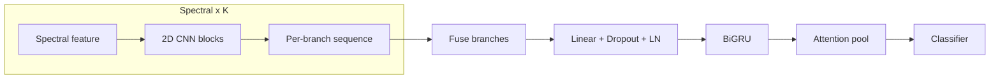
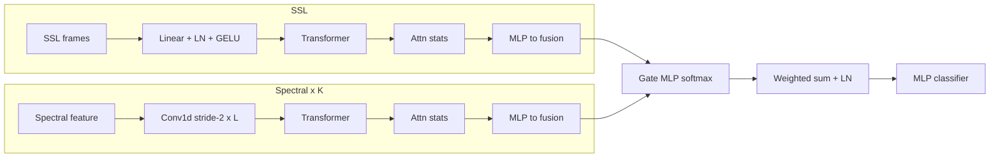
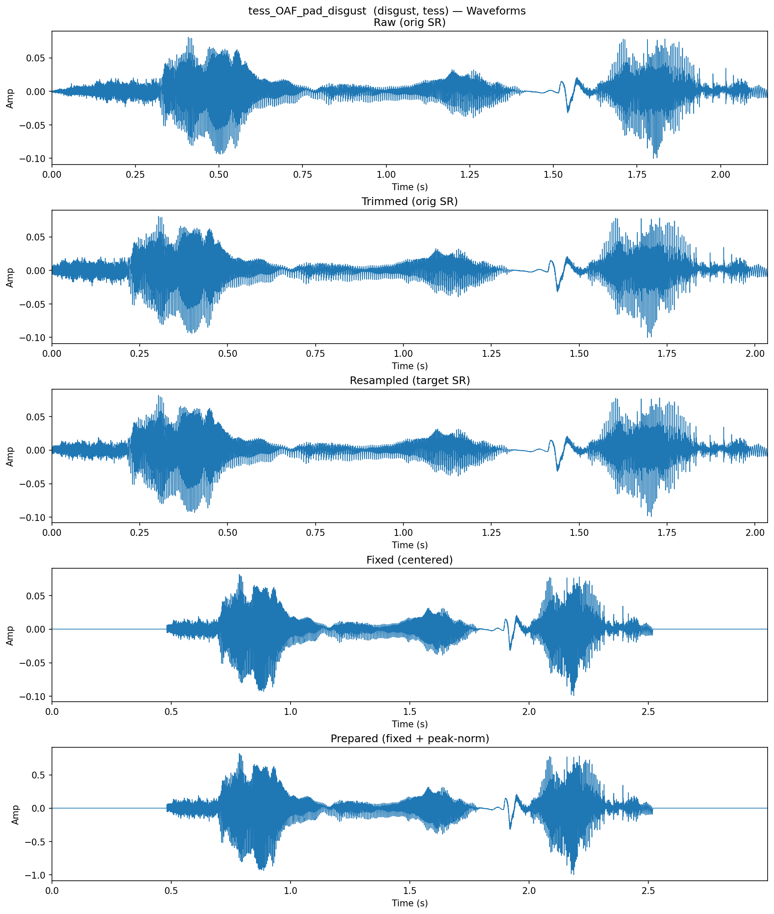
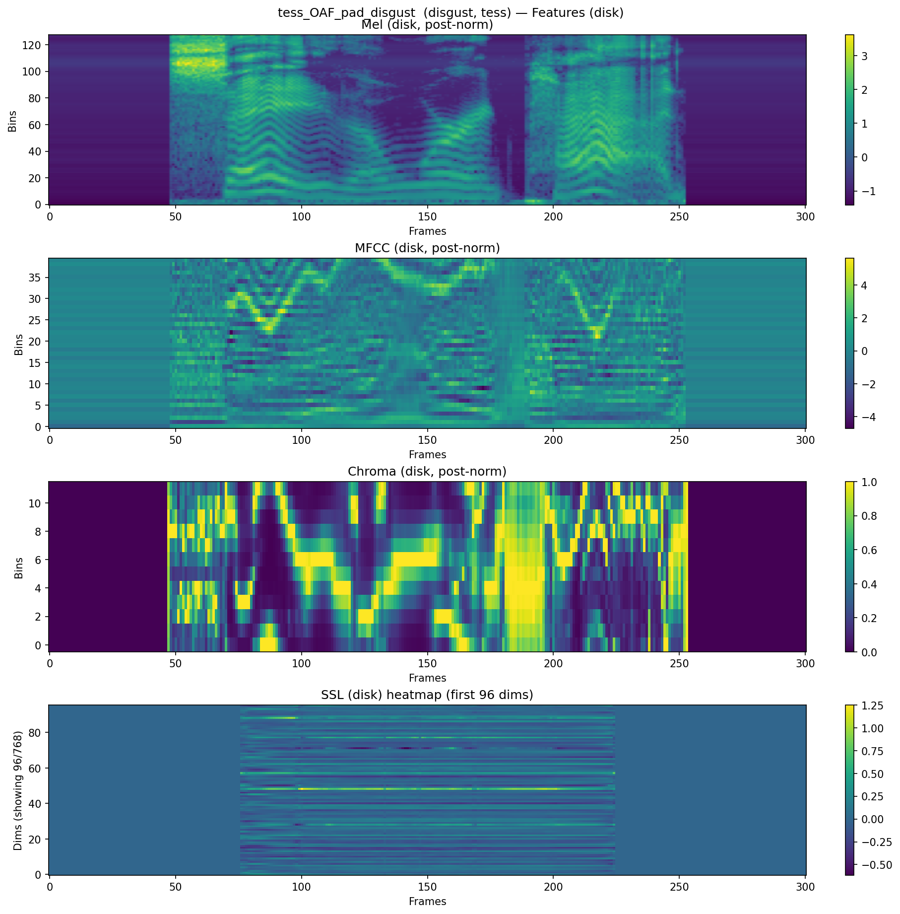

# Speech Emotion Recognition
A pipeline for multi-corpus speech emotion recognition with precomputed features, speaker-aware splits, and two model families.

Supported datasets: **CREMA-D**, **RAVDESS**, **SAVEE**, **TESS**. You supply the raw audio; the repo handles indexing, splitting, feature extraction, training, and basic visualization.

## How to Run
1. **Install** (Python ≥ 3.9)
    ```
    python -m venv .venv
    source .venv/bin/activate
    pip install -U pip
    pip install -e .            # core
   
    # Optional extras
    pip install -e .[metrics]   # scikit-learn reports
    pip install -e .[viz]       # visualization scripts
    # or developer setup
    pip install -e .[dev]
    ```

2. **Data layout**
    
    Place datasets under `data/raw/` (original folder/file names from Kaggle are fine; recursion is supported):
    ```
    data/raw/
      crema/    ravdess/    savee/    tess/
    ```

3. **Run the pipeline**
    
    Use the CLI entrypoint `ser`:
    ```
    # Full pipeline
    ser --config spectral_crnn.yaml --steps extract,transform,load,train -v
    
    # Or run individual steps
    ser --config spectral_crnn.yaml --steps extract   -v
    ser --config spectral_crnn.yaml --steps transform -v
    ser --config spectral_crnn.yaml --steps load      -v
    ser --config spectral_crnn.yaml --steps train     -v
    ```

    Choose a model by config:
   - `spectral_crnn.yaml`
   - `ssl_spectral_moe.yaml`
   
    Artifacts are written to `data/processed/` and `runs/<timestamp>_<model>/`.

## Models
### 1) Spectral CRNN (`spectral_crnn`)
**Inputs.** Any subset of the spectral features: Mel, MFCC, and Chroma. The order of branches must match `model.features` in the config. The input tensor is `[batch, branches, freq_bins_max, frames]`. Each branch uses only its own number of frequency rows.

**Processing steps.**
1. **Per-feature 2D CNN branch.** Each spectral branch applies small Conv2d blocks with BatchNorm and ReLU, plus two max-pool layers. The CNN output is reshaped per time step and projected with a linear layer and GELU to form a sequence of vectors for that branch.
2. **Fusion and temporal encoder.** The branch sequences are concatenated along the feature dimension, passed through a linear bottleneck with dropout and LayerNorm, then processed by a bidirectional GRU over time.
3. **Attention pooling and classifier.** A learned softmax attention pools the time sequence to one utterance-level vector. Dropout and a final linear layer produce class logits.

**Why this structure.** Separate CNN branches specialize on different spectral cues. The shared GRU models temporal dynamics. Attention focuses on the most informative frames.


   
### 2) SSL and Spectral Mixture-of-Experts (`ssl_spectral_moe`)
**Inputs.** Include one SSL feature (e.g., WavLM Base+) and at least one spectral feature. The branch order must match `model.features`.

**SSL expert.** Consumes frame-level SSL embeddings (precomputed with a frozen backbone) and produces one utterance vector that competes with the spectral experts inside the MoE.
1. Linear projection with LayerNorm and GELU (sets the working dimension).
2. Lightweight Transformer encoder layers for temporal refinement.
3. Attentive statistics pooling (attention-weighted mean and standard deviation).
4. LayerNorm and an MLP to map to the common fusion dimension.

**Spectral experts.** One path per spectral feature (Mel, MFCC, Chroma).
1. Stacked Conv1d layers over time with stride 2 to downsample and mix context.
2. Optional tiny Transformer encoder.
3. Attentive statistics pooling, then LayerNorm and an MLP to the fusion dimension

**Gating and classifier.**
1. A small gating MLP outputs softmax weights over all experts.
2. Expert vectors are combined by a weighted sum in the fusion space and normalized with LayerNorm.
3. An MLP classifier maps the fused vector to logits. An auxiliary classifier can be attached to a chosen spectral expert if you want an extra training signal.

**Notes.**
- SSL features are precomputed and stored on disk. The SSL backbone is not fine-tuned here.
- SpecAugment is applied only to spectral features during training, not to SSL.
- Attention weights and gate probabilities are interpretable and can be logged for analysis.

**Why this structure.** SSL embeddings offer strong general-purpose acoustic cues; spectral features carry pitch, timbre, and formant detail. The MoE lets the model adaptively weight these sources per utterance.



## Outputs
Each run directory under `runs/` contains:
- `cfg.json` with the exact config used
- `best.pth` and `last.pth` checkpoints
- `history.csv` with per-epoch metrics and learning rate
- `test_metrics.json` and `confusion_matrix.csv`

## Visualization
Inspect a sample's waveform stages and features (including SSL slices), for example:
```
python scripts/visualize_sample.py --config spectral_crnn.yaml --row-idx 0 --save
```
Figures are saved under `reports/vis/<base_id>/`.

### Examples
<p align="center">
  
  <br/>
  <em>Waveform stages: raw → trimmed → resampled → fixed → prepared</em>
</p>

<p align="center">
  
  <br/>
  <em>Mel / MFCC / Chroma (post-normalization) and SSL heatmap loaded from disk</em>
</p>

## License and datasets
Code is MIT (see `LICENSE.md`).

Datasets keep their original licenses. Follow the terms for CREMA-D, RAVDESS, SAVEE, and TESS.

## Citation
If you use this project, please cite your SSL backbone (e.g., WavLM or HuBERT) and this repository.
